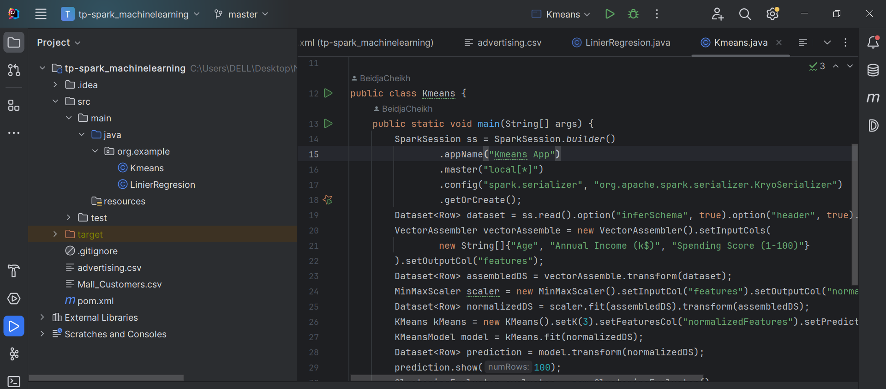
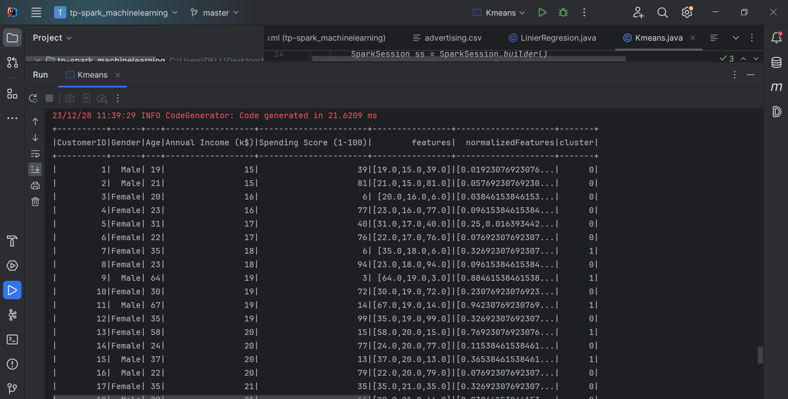

  
<h2></h2>
<h1>compte rendu</h1>
<h1>Beidja Cheikh</h1>
<h1>Master SDIA2</h1>
L'objectif de ce code Java utilisant Apache Spark MLlib est d'appliquer l'algorithme de clustering K-Means à un ensemble de données 
de clients de centre commercial. Les principales étapes comprennent le chargement des données, l'assemblage des fonctionnalités, la normalisation, l'entraînement du modèle K-Means, la réalisation de prédictions et l'évaluation de la qualité des clusters formés. L'objectif final est d'obtenir une segmentation des clients en groupes distincts en fonction de leurs caractéristiques, comme l'âge, le revenu annuel, et le score de dépenses.
<h2>Kmeans</h2>
  
  
<h2>le score</h2> 
  